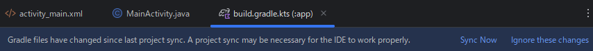

Zebra プリンタ - Bluetooth 印刷デモ用のAndroid Apkとソースコード - Android 14 (ZQ220p + ZQ220p SDK）

Update: 2026/04/28

本頁は下記環境で開発する場合を前提とした環境構築ガイドとなる。


|アイテム| 詳細|
|-|-|
| プリンタ| Zebra ZQ220 plus
| プリンタSDK   | Forerunner Android SDK Development manual v1.1以上
| Android端末   | Zebra Android端末, Android 14を想定
| 開発環境  | Android Studio Otter 3 Feature Drop 2025.2.3
| 開発言語  | Java


## 本頁の前提

本頁は下記ドキュメントをベースに作成。詳細は下記ドキュメントを参照すること。
- Forerunner Android SDK Development manual vx.x

---

## 環境構築・簡易ガイド

### SDKの入手

1. Zebra Technologiesから下記を入手
   1. SDKプログラム（jar)
   2. 開発ガイド（Forerunner Android SDK Development manual vx.x）
</br>

### Android端末の設定

1. Bluetoothが利用できるように設定：ON にする。

### Android Studioの操作
1. Android Studioを起動。
1. Emtpy Views ActivityでProjectを新規作成。
2. jarファイルのImplement。
   1. ~/app/libs フォルダを作成。
   2. "ZebraPrinter_Android_SDK_x.x.jar"をlibs内にコピーする。
   3. "build.gradle.kts(Module.app)"にimplementation宣言する。
        ```
        dependencies {
        ...    
        androidTestImplementation(libs.espresso.core)
        implementation(files("libs/ZebraPrinter_Android_SDK_1.1.jar"))★
        }
        ```
    1. Sync Nowを選択する。
    
    </br>

1. MainActivityにおいて、importが可能であることを確認する。
   ```
   import com.zebra.printer.sdk.ZebraPrinter;
   ```
1. これでSDK(jar)を活用した開発が可能となる。
</br>

### 付録１: Bluetooth通信時の権限

AndroidではBluetooth通信の際は、通信方法に応じてPermissionの宣言が必要。
下記にPermission宣言文の一例を記載する。
詳細については、下記リンクを参照。
</br>

#### Bluetoothの権限
https://developer.android.com/develop/connectivity/bluetooth/bt-permissions?hl=ja

- Sample: AndroidManifest.xml 
    ```xml
    <?xml version="1.0" encoding="utf-8"?>
    <manifest xmlns:android="http://schemas.android.com/apk/res/android"
    xmlns:tools="http://schemas.android.com/tools">

    <uses-feature android:name="android.hardware.bluetooth" android:required="true" />
    <uses-permission android:name="android.permission.BLUETOOTH" />
    <uses-permission android:name="android.permission.BLUETOOTH_ADMIN" />
    <uses-permission android:name="android.permission.BLUETOOTH_CONNECT" />
    <uses-permission android:name="android.permission.BLUETOOTH_SCAN" />
    <uses-permission android:name="android.permission.ACCESS_COARSE_LOCATION" />
    <uses-permission android:name="android.permission.ACCESS_FINE_LOCATION" />
    ....
    ```
</br>

### 付録２: MainActivity.java Sample

```java
package com.example.myapplication;

import android.Manifest;
import android.content.pm.PackageManager;
import android.os.Bundle;
import android.util.Log;

import androidx.activity.EdgeToEdge;
import androidx.annotation.NonNull;
import androidx.appcompat.app.AppCompatActivity;
import androidx.core.app.ActivityCompat;
import androidx.core.content.ContextCompat;
import androidx.core.graphics.Insets;
import androidx.core.view.ViewCompat;
import androidx.core.view.WindowInsetsCompat;

import java.io.UnsupportedEncodingException;

import com.zebra.printer.sdk.ZebraPrinter;


public class MainActivity extends AppCompatActivity {

    private static final int REQUEST_BLUETOOTH_PERMISSIONS = 1;
    private static final String btMac = "04:7F:0E:71:7F:53";

    private static final String strCpcl01 =
            "! 0 200 200 400 1\r\n" +
                    "COUNTRY JAPAN-S\r\n" +
                    "SETMAG 1 1\r\n" +
                    "SETBOLD 2\r\n" +
                    "T GT16NF55.CPF 0 0 0 サイズ１６\r\n" +
                    "T GT24NF55.CPF 0 0 30 サイズ２４\r\n" +
                    "PRINT\r\n";
    String TAG1 = "ZBR_";
    String tagLogd = "NULL";

    long start = 0;
    long end = 0;

    boolean bOpen = false;
    int printerStatus=9999;
    String strSgdCmd = "print.tone";
    StringBuffer strSgdGet = new StringBuffer();
    String strSgdSet = "";


    
    @Override
    protected void onCreate(Bundle savedInstanceState) {
        super.onCreate(savedInstanceState);
        EdgeToEdge.enable(this);
        setContentView(R.layout.activity_main);
        ViewCompat.setOnApplyWindowInsetsListener(findViewById(R.id.main), (v, insets) -> {
            Insets systemBars = insets.getInsets(WindowInsetsCompat.Type.systemBars());
            v.setPadding(systemBars.left, systemBars.top, systemBars.right, systemBars.bottom);
            return insets;
        });
        processMain();
    }

    private void processMain(){
        tagLogd = TAG1 + new Throwable()
                .getStackTrace()[0]
                .getMethodName();

        int count=0;

        checkAndRequestBluetoothPermissions();


        open();

        getPrinterStatus();

        try {
            Thread.sleep(1000); 
        } catch (InterruptedException e) {
            e.printStackTrace();
        }

        for (int i = 0; i < 1; i++) {
            Log.d(tagLogd, "## Print  " + String.valueOf(count++));
            cpcl_print();

            try {
                Thread.sleep(500); // mili-seconds
            } catch (InterruptedException e) {
                e.printStackTrace();
            }

        }

        try {
            Thread.sleep(1000); 
        } catch (InterruptedException e) {
            e.printStackTrace();
        }

        getvar();
        setvar();

        close();
    }


    public void open(){
        tagLogd = TAG1 + new Throwable()
                .getStackTrace()[0]
                .getMethodName();
        start = System.currentTimeMillis();
        printerStatus = ZebraPrinter.Open(0, btMac);
        end = System.currentTimeMillis();
        Log.d(tagLogd, "Status: " + String.valueOf(printerStatus));
        Log.d(tagLogd, "Process Time: " + (end-start) + " ms");
    }

    public void close(){
        tagLogd = TAG1 + new Throwable()
                .getStackTrace()[0]
                .getMethodName();
        start = System.currentTimeMillis();
        printerStatus = ZebraPrinter.Close();
        end = System.currentTimeMillis();
        Log.d(tagLogd, "Status: " + String.valueOf(printerStatus));
        Log.d(tagLogd, "Process Time: " + (end-start) + " ms");
    }

    public void setlog(){
        //
        // Debugging purpose only
        //
        ZebraPrinter.SetLog(3);
    }
    
    public void getPrinterStatus(){
        //
        // PROCESS: GET PRINTER STATUS
        //
        tagLogd = TAG1 + new Throwable()
                .getStackTrace()[0]
                .getMethodName();
        start = System.currentTimeMillis();
        printerStatus = ZebraPrinter.GetPrinterState();
        end = System.currentTimeMillis();
        Log.d(tagLogd, "Printer status is " + String.valueOf(printerStatus) + ".");
        Log.d(tagLogd, "Process Time: " + (end-start) + " ms");
    }
    
    public void getvar(){
        //
        // PROCESS: GETVAR
        //
        strSgdGet = new StringBuffer();
        strSgdCmd = "power.percent_raw";
        start = System.currentTimeMillis();
        printerStatus = ZebraPrinter.SGD_GetVar(strSgdCmd, strSgdGet);
        //textView.setText("NO STATUS.");
        end = System.currentTimeMillis();
        Log.d(tagLogd, "Status: " + String.valueOf(printerStatus));
        //Log.d(tagLogd, "Battery remain is : " + String.valueOf(strSgdGet).replace("ready", "") + " %");
        Log.d(tagLogd, "Battery remain is : " + String.valueOf(strSgdGet) + " %");
        Log.d(tagLogd, "Process Time: " + (end-start) + " ms");
    }

    public void setvar(){
        //
        // PROCESS: SETVAR
        //
        strSgdGet = new StringBuffer();
        strSgdSet = "100";
        strSgdCmd = "print.tone";
        start = System.currentTimeMillis();
        printerStatus = ZebraPrinter.SGD_SetVar(strSgdCmd, strSgdSet);
        printerStatus = ZebraPrinter.SGD_GetVar(strSgdCmd, strSgdGet);
        end = System.currentTimeMillis();
        Log.d(tagLogd, "Print.tone setting is  " +  String.valueOf(strSgdGet) + ".");
        Log.d(tagLogd, "Process Time: " + (end-start) + " ms");
    }
    public void cpcl_print(){
        tagLogd = TAG1 + new Throwable()
                .getStackTrace()[0]
                .getMethodName();

        //String strCpcl = "sample text";

        String strCpcl = strCpcl01;
        start = System.currentTimeMillis();

        try {
            byte[] sjisData = strCpcl.getBytes("Shift_JIS");
            printerStatus = ZebraPrinter.WriteData(sjisData);
        }catch(UnsupportedEncodingException e){
            e.printStackTrace();
        }
        //textView.setText("NO STATUS.");
        end = System.currentTimeMillis();
        Log.d(tagLogd, "Status: " + String.valueOf(printerStatus));
        Log.d(tagLogd, "Process Time: " + (end-start) + " ms");
    }

    private void checkAndRequestBluetoothPermissions() {

        tagLogd = TAG1 + new Throwable()
                .getStackTrace()[0]
                .getMethodName();

        String[] permissions = {
                Manifest.permission.BLUETOOTH_CONNECT,
                Manifest.permission.BLUETOOTH_SCAN,
                Manifest.permission.ACCESS_FINE_LOCATION
        };

        // Check permission
        boolean permissionsNeeded = false;

        for (String permission : permissions) {
            // boolean granted
            // == false: User permission is necessary
            // == true:  User permission is unnecessary
            boolean granted = ContextCompat.checkSelfPermission(this, permission) == PackageManager.PERMISSION_GRANTED;

            if (!granted){
                permissionsNeeded = true;
                //break;
            }

            // DEBUG LOG
            Log.d(tagLogd, "Permission: " + permission + " is " + granted);

        }

        // Request premission if needed
        if (permissionsNeeded) {
            // DEBUG LOG
            Log.d(tagLogd, "Bluetooth permission is requested to user.");
            ActivityCompat.requestPermissions(this, permissions, REQUEST_BLUETOOTH_PERMISSIONS);
        }
    }

    @Override
    public void onRequestPermissionsResult(int requestCode, @NonNull String[] permissions, @NonNull int[] grantResults) {
        super.onRequestPermissionsResult(requestCode, permissions, grantResults);

        tagLogd = TAG1 + new Throwable()
                .getStackTrace()[0]
                .getMethodName();

        if (requestCode == REQUEST_BLUETOOTH_PERMISSIONS) {

            boolean allGranted = true;

            for (int result : grantResults) {
                if (result != PackageManager.PERMISSION_GRANTED) {
                    allGranted = false;
                    break;
                }
            }

            if (allGranted) {
                // Bluetooth処理開始
                // DEBUG LOG
                Log.d(tagLogd, String.valueOf(allGranted));
            } else {
                // 拒否時処理（説明 or 機能制限）
                // DEBUG LOG
                Log.d(tagLogd, String.valueOf(allGranted));
            }
        }
    }


}

```
